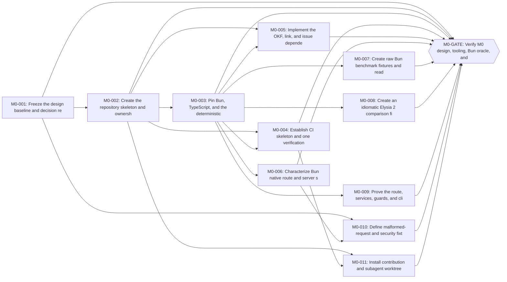
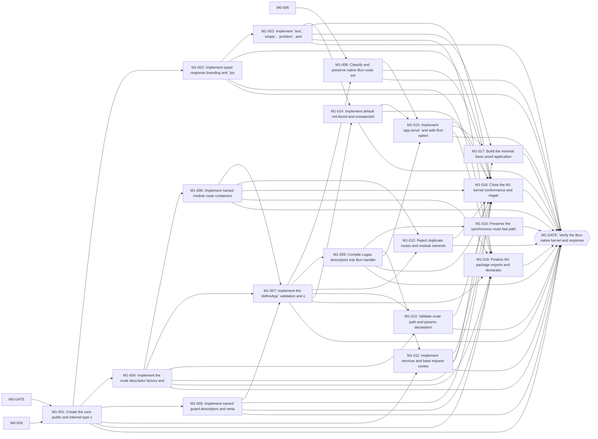
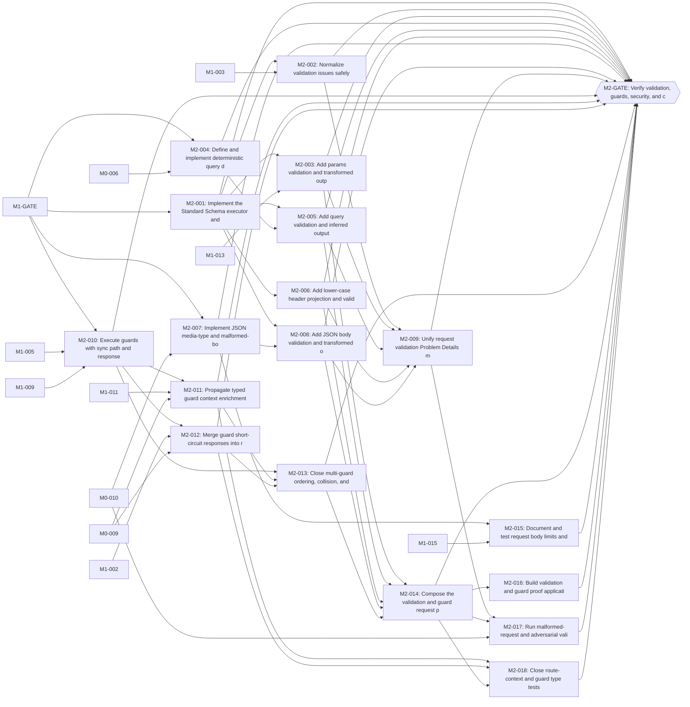
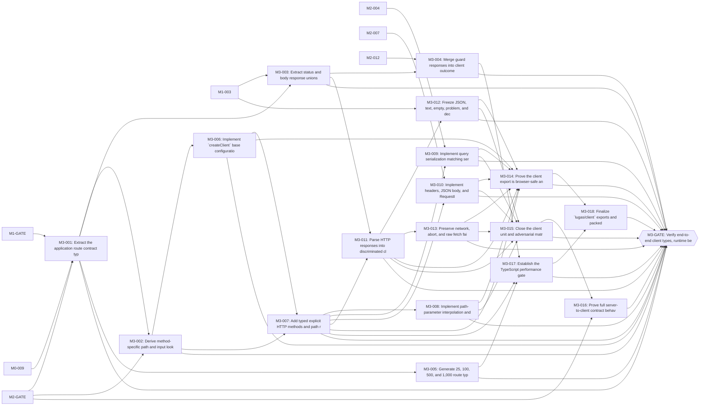
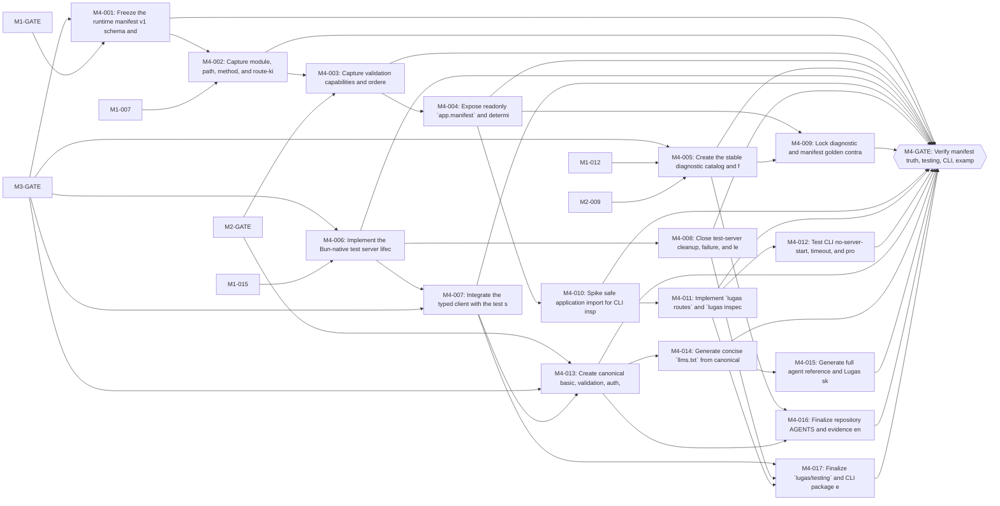
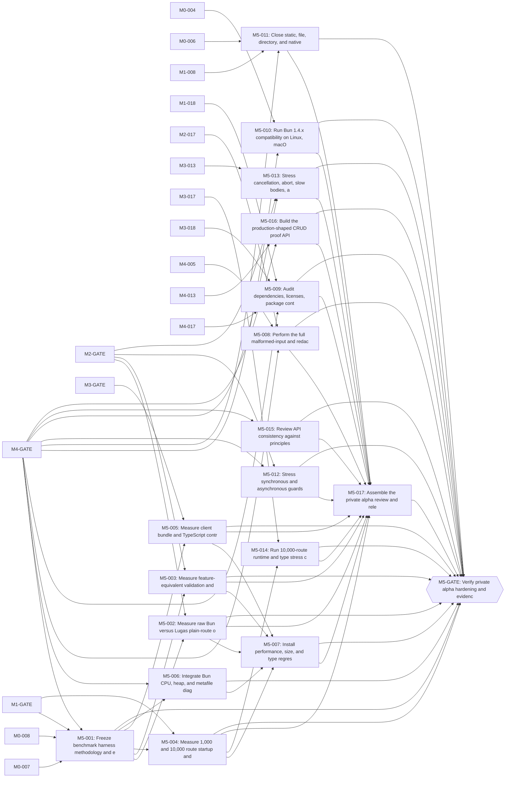
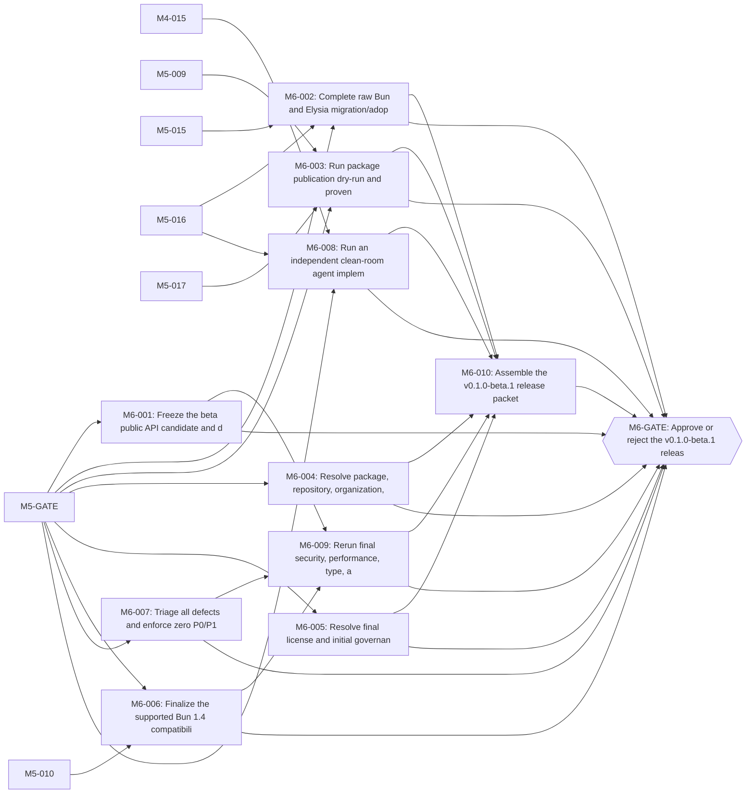

# LugasJS Issue Dependency Graph

The graph is mechanically validated as a DAG. Gate nodes create milestone barriers.

## M0

```mermaid
flowchart LR
  M0_001["M0-001: Freeze the design baseline and decision re"]
  M0_002["M0-002: Create the repository skeleton and ownersh"]
  M0_003["M0-003: Pin Bun, TypeScript, and the deterministic"]
  M0_004["M0-004: Establish CI skeleton and one verification"]
  M0_005["M0-005: Implement the OKF, link, and issue depende"]
  M0_006["M0-006: Characterize Bun native route and server s"]
  M0_007["M0-007: Create raw Bun benchmark fixtures and read"]
  M0_008["M0-008: Create an idiomatic Elysia 2 comparison fi"]
  M0_009["M0-009: Prove the route, services, guards, and cli"]
  M0_010["M0-010: Define malformed-request and security fixt"]
  M0_011["M0-011: Install contribution and subagent worktree"]
  M0_GATE{{"M0-GATE: Verify M0 design, tooling, Bun oracle, and"}}
  M0_001 --> M0_002
  M0_002 --> M0_003
  M0_002 --> M0_004
  M0_003 --> M0_004
  M0_002 --> M0_005
  M0_003 --> M0_005
  M0_003 --> M0_006
  M0_003 --> M0_007
  M0_003 --> M0_008
  M0_003 --> M0_009
  M0_001 --> M0_010
  M0_006 --> M0_010
  M0_002 --> M0_011
  M0_004 --> M0_011
  M0_001 --> M0_GATE
  M0_002 --> M0_GATE
  M0_003 --> M0_GATE
  M0_004 --> M0_GATE
  M0_005 --> M0_GATE
  M0_006 --> M0_GATE
  M0_007 --> M0_GATE
  M0_008 --> M0_GATE
  M0_009 --> M0_GATE
  M0_010 --> M0_GATE
  M0_011 --> M0_GATE
```

## M1

```mermaid
flowchart LR
  M0_006["M0-006"]
  M0_009["M0-009"]
  M0_GATE["M0-GATE"]
  M1_001["M1-001: Create the core public and internal type s"]
  M1_002["M1-002: Implement typed response branding and `jso"]
  M1_003["M1-003: Implement `text`, `empty`, `problem`, and "]
  M1_004["M1-004: Implement the route descriptor factory and"]
  M1_005["M1-005: Implement named guard descriptors and meta"]
  M1_006["M1-006: Implement named module route containers"]
  M1_007["M1-007: Implement the `defineApp` validation and c"]
  M1_008["M1-008: Classify and preserve native Bun route ent"]
  M1_009["M1-009: Compile Lugas descriptors into Bun handler"]
  M1_010["M1-010: Preserve the synchronous route fast path"]
  M1_011["M1-011: Implement services and base request contex"]
  M1_012["M1-012: Reject duplicate routes and module ownersh"]
  M1_013["M1-013: Validate route path and params declaration"]
  M1_014["M1-014: Implement default not-found and unexpected"]
  M1_015["M1-015: Implement `app.serve` and safe Bun option "]
  M1_016["M1-016: Close the M1 kernel conformance and negati"]
  M1_017["M1-017: Build the minimal basic proof application"]
  M1_018["M1-018: Finalize M1 package exports and declaratio"]
  M1_GATE{{"M1-GATE: Verify the Bun-native kernel and response "}}
  M0_GATE --> M1_001
  M0_009 --> M1_001
  M1_001 --> M1_002
  M1_002 --> M1_003
  M1_001 --> M1_004
  M1_001 --> M1_005
  M1_004 --> M1_006
  M1_004 --> M1_007
  M1_005 --> M1_007
  M1_006 --> M1_007
  M1_007 --> M1_008
  M0_006 --> M1_008
  M1_007 --> M1_009
  M1_009 --> M1_010
  M1_001 --> M1_011
  M1_009 --> M1_011
  M1_006 --> M1_012
  M1_007 --> M1_012
  M1_004 --> M1_013
  M1_007 --> M1_013
  M1_003 --> M1_014
  M1_007 --> M1_014
  M1_008 --> M1_015
  M1_009 --> M1_015
  M1_014 --> M1_015
  M1_002 --> M1_016
  M1_003 --> M1_016
  M1_004 --> M1_016
  M1_005 --> M1_016
  M1_006 --> M1_016
  M1_008 --> M1_016
  M1_009 --> M1_016
  M1_011 --> M1_016
  M1_012 --> M1_016
  M1_013 --> M1_016
  M1_014 --> M1_016
  M1_015 --> M1_016
  M1_003 --> M1_017
  M1_011 --> M1_017
  M1_015 --> M1_017
  M1_001 --> M1_018
  M1_002 --> M1_018
  M1_003 --> M1_018
  M1_004 --> M1_018
  M1_005 --> M1_018
  M1_006 --> M1_018
  M1_007 --> M1_018
  M1_015 --> M1_018
  M1_001 --> M1_GATE
  M1_002 --> M1_GATE
  M1_003 --> M1_GATE
  M1_004 --> M1_GATE
  M1_005 --> M1_GATE
  M1_006 --> M1_GATE
  M1_007 --> M1_GATE
  M1_008 --> M1_GATE
  M1_009 --> M1_GATE
  M1_010 --> M1_GATE
  M1_011 --> M1_GATE
  M1_012 --> M1_GATE
  M1_013 --> M1_GATE
  M1_014 --> M1_GATE
  M1_015 --> M1_GATE
  M1_016 --> M1_GATE
  M1_017 --> M1_GATE
  M1_018 --> M1_GATE
```

## M2

```mermaid
flowchart LR
  M0_006["M0-006"]
  M0_009["M0-009"]
  M0_010["M0-010"]
  M1_002["M1-002"]
  M1_003["M1-003"]
  M1_005["M1-005"]
  M1_009["M1-009"]
  M1_011["M1-011"]
  M1_013["M1-013"]
  M1_015["M1-015"]
  M1_GATE["M1-GATE"]
  M2_001["M2-001: Implement the Standard Schema executor and"]
  M2_002["M2-002: Normalize validation issues safely"]
  M2_003["M2-003: Add params validation and transformed outp"]
  M2_004["M2-004: Define and implement deterministic query d"]
  M2_005["M2-005: Add query validation and inferred output"]
  M2_006["M2-006: Add lower-case header projection and valid"]
  M2_007["M2-007: Implement JSON media-type and malformed-bo"]
  M2_008["M2-008: Add JSON body validation and transformed o"]
  M2_009["M2-009: Unify request validation Problem Details m"]
  M2_010["M2-010: Execute guards with sync path and response"]
  M2_011["M2-011: Propagate typed guard context enrichment"]
  M2_012["M2-012: Merge guard short-circuit responses into r"]
  M2_013["M2-013: Close multi-guard ordering, collision, and"]
  M2_014["M2-014: Compose the validation and guard request p"]
  M2_015["M2-015: Document and test request body limits and "]
  M2_016["M2-016: Build validation and guard proof applicati"]
  M2_017["M2-017: Run malformed-request and adversarial vali"]
  M2_018["M2-018: Close route-context and guard type tests"]
  M2_GATE{{"M2-GATE: Verify validation, guards, security, and c"}}
  M1_GATE --> M2_001
  M2_001 --> M2_002
  M1_003 --> M2_002
  M2_001 --> M2_003
  M1_013 --> M2_003
  M1_GATE --> M2_004
  M0_006 --> M2_004
  M2_001 --> M2_005
  M2_004 --> M2_005
  M2_001 --> M2_006
  M1_GATE --> M2_007
  M0_010 --> M2_007
  M2_001 --> M2_008
  M2_007 --> M2_008
  M2_002 --> M2_009
  M2_003 --> M2_009
  M2_005 --> M2_009
  M2_006 --> M2_009
  M2_008 --> M2_009
  M1_GATE --> M2_010
  M1_005 --> M2_010
  M1_009 --> M2_010
  M2_010 --> M2_011
  M1_011 --> M2_011
  M0_009 --> M2_011
  M2_010 --> M2_012
  M1_002 --> M2_012
  M0_009 --> M2_012
  M2_010 --> M2_013
  M2_011 --> M2_013
  M2_012 --> M2_013
  M2_003 --> M2_014
  M2_005 --> M2_014
  M2_006 --> M2_014
  M2_008 --> M2_014
  M2_013 --> M2_014
  M2_007 --> M2_015
  M1_015 --> M2_015
  M2_014 --> M2_016
  M2_009 --> M2_017
  M2_014 --> M2_017
  M0_010 --> M2_017
  M2_011 --> M2_018
  M2_012 --> M2_018
  M2_014 --> M2_018
  M2_001 --> M2_GATE
  M2_002 --> M2_GATE
  M2_003 --> M2_GATE
  M2_004 --> M2_GATE
  M2_005 --> M2_GATE
  M2_006 --> M2_GATE
  M2_007 --> M2_GATE
  M2_008 --> M2_GATE
  M2_009 --> M2_GATE
  M2_010 --> M2_GATE
  M2_011 --> M2_GATE
  M2_012 --> M2_GATE
  M2_013 --> M2_GATE
  M2_014 --> M2_GATE
  M2_015 --> M2_GATE
  M2_016 --> M2_GATE
  M2_017 --> M2_GATE
  M2_018 --> M2_GATE
```

## M3

```mermaid
flowchart LR
  M0_009["M0-009"]
  M1_003["M1-003"]
  M1_GATE["M1-GATE"]
  M2_004["M2-004"]
  M2_007["M2-007"]
  M2_012["M2-012"]
  M2_GATE["M2-GATE"]
  M3_001["M3-001: Extract the application route contract typ"]
  M3_002["M3-002: Derive method-specific path and input look"]
  M3_003["M3-003: Extract status and body response unions"]
  M3_004["M3-004: Merge guard responses into client outcome "]
  M3_005["M3-005: Generate 25, 100, 500, and 1,000 route typ"]
  M3_006["M3-006: Implement `createClient` base configuratio"]
  M3_007["M3-007: Add typed explicit HTTP methods and path r"]
  M3_008["M3-008: Implement path-parameter interpolation and"]
  M3_009["M3-009: Implement query serialization matching ser"]
  M3_010["M3-010: Implement headers, JSON body, and RequestI"]
  M3_011["M3-011: Parse HTTP responses into discriminated cl"]
  M3_012["M3-012: Freeze JSON, text, empty, problem, and dec"]
  M3_013["M3-013: Preserve network, abort, and raw fetch fai"]
  M3_014["M3-014: Prove the client export is browser-safe an"]
  M3_015["M3-015: Close the client unit and adversarial matr"]
  M3_016["M3-016: Prove full server-to-client contract behav"]
  M3_017["M3-017: Establish the TypeScript performance gate "]
  M3_018["M3-018: Finalize `lugas/client` exports and packed"]
  M3_GATE{{"M3-GATE: Verify end-to-end client types, runtime be"}}
  M2_GATE --> M3_001
  M1_GATE --> M3_001
  M0_009 --> M3_001
  M3_001 --> M3_002
  M2_GATE --> M3_002
  M3_001 --> M3_003
  M1_003 --> M3_003
  M3_003 --> M3_004
  M2_012 --> M3_004
  M3_001 --> M3_005
  M3_002 --> M3_006
  M3_002 --> M3_007
  M3_006 --> M3_007
  M3_007 --> M3_008
  M3_007 --> M3_009
  M2_004 --> M3_009
  M3_007 --> M3_010
  M2_007 --> M3_010
  M3_003 --> M3_011
  M3_007 --> M3_011
  M3_011 --> M3_012
  M1_003 --> M3_012
  M3_011 --> M3_013
  M3_006 --> M3_014
  M3_007 --> M3_014
  M3_008 --> M3_014
  M3_009 --> M3_014
  M3_010 --> M3_014
  M3_011 --> M3_014
  M3_012 --> M3_014
  M3_013 --> M3_014
  M3_008 --> M3_015
  M3_009 --> M3_015
  M3_010 --> M3_015
  M3_011 --> M3_015
  M3_012 --> M3_015
  M3_013 --> M3_015
  M2_GATE --> M3_016
  M3_015 --> M3_016
  M3_004 --> M3_017
  M3_005 --> M3_017
  M3_007 --> M3_017
  M3_014 --> M3_018
  M3_017 --> M3_018
  M3_001 --> M3_GATE
  M3_002 --> M3_GATE
  M3_003 --> M3_GATE
  M3_004 --> M3_GATE
  M3_005 --> M3_GATE
  M3_006 --> M3_GATE
  M3_007 --> M3_GATE
  M3_008 --> M3_GATE
  M3_009 --> M3_GATE
  M3_010 --> M3_GATE
  M3_011 --> M3_GATE
  M3_012 --> M3_GATE
  M3_013 --> M3_GATE
  M3_014 --> M3_GATE
  M3_015 --> M3_GATE
  M3_016 --> M3_GATE
  M3_017 --> M3_GATE
  M3_018 --> M3_GATE
```

## M4

```mermaid
flowchart LR
  M1_007["M1-007"]
  M1_012["M1-012"]
  M1_015["M1-015"]
  M1_GATE["M1-GATE"]
  M2_009["M2-009"]
  M2_GATE["M2-GATE"]
  M3_GATE["M3-GATE"]
  M4_001["M4-001: Freeze the runtime manifest v1 schema and "]
  M4_002["M4-002: Capture module, path, method, and route-ki"]
  M4_003["M4-003: Capture validation capabilities and ordere"]
  M4_004["M4-004: Expose readonly `app.manifest` and determi"]
  M4_005["M4-005: Create the stable diagnostic catalog and f"]
  M4_006["M4-006: Implement the Bun-native test server lifec"]
  M4_007["M4-007: Integrate the typed client with the test s"]
  M4_008["M4-008: Close test-server cleanup, failure, and le"]
  M4_009["M4-009: Lock diagnostic and manifest golden contra"]
  M4_010["M4-010: Spike safe application import for CLI insp"]
  M4_011["M4-011: Implement `lugas routes` and `lugas inspec"]
  M4_012["M4-012: Test CLI no-server-start, timeout, and pro"]
  M4_013["M4-013: Create canonical basic, validation, auth, "]
  M4_014["M4-014: Generate concise `llms.txt` from canonical"]
  M4_015["M4-015: Generate full agent reference and Lugas sk"]
  M4_016["M4-016: Finalize repository AGENTS and evidence en"]
  M4_017["M4-017: Finalize `lugas/testing` and CLI package e"]
  M4_GATE{{"M4-GATE: Verify manifest truth, testing, CLI, examp"}}
  M3_GATE --> M4_001
  M1_GATE --> M4_001
  M4_001 --> M4_002
  M1_007 --> M4_002
  M4_002 --> M4_003
  M2_GATE --> M4_003
  M4_003 --> M4_004
  M3_GATE --> M4_005
  M1_012 --> M4_005
  M2_009 --> M4_005
  M3_GATE --> M4_006
  M1_015 --> M4_006
  M4_006 --> M4_007
  M3_GATE --> M4_007
  M4_006 --> M4_008
  M4_004 --> M4_009
  M4_005 --> M4_009
  M4_004 --> M4_010
  M4_010 --> M4_011
  M4_011 --> M4_012
  M2_GATE --> M4_013
  M3_GATE --> M4_013
  M4_007 --> M4_013
  M4_013 --> M4_014
  M4_014 --> M4_015
  M4_005 --> M4_016
  M4_013 --> M4_016
  M4_007 --> M4_017
  M4_008 --> M4_017
  M4_011 --> M4_017
  M4_001 --> M4_GATE
  M4_002 --> M4_GATE
  M4_003 --> M4_GATE
  M4_004 --> M4_GATE
  M4_005 --> M4_GATE
  M4_006 --> M4_GATE
  M4_007 --> M4_GATE
  M4_008 --> M4_GATE
  M4_009 --> M4_GATE
  M4_010 --> M4_GATE
  M4_011 --> M4_GATE
  M4_012 --> M4_GATE
  M4_013 --> M4_GATE
  M4_014 --> M4_GATE
  M4_015 --> M4_GATE
  M4_016 --> M4_GATE
  M4_017 --> M4_GATE
```

## M5

```mermaid
flowchart LR
  M0_004["M0-004"]
  M0_006["M0-006"]
  M0_007["M0-007"]
  M0_008["M0-008"]
  M1_008["M1-008"]
  M1_018["M1-018"]
  M1_GATE["M1-GATE"]
  M2_017["M2-017"]
  M2_GATE["M2-GATE"]
  M3_013["M3-013"]
  M3_017["M3-017"]
  M3_018["M3-018"]
  M3_GATE["M3-GATE"]
  M4_005["M4-005"]
  M4_013["M4-013"]
  M4_017["M4-017"]
  M4_GATE["M4-GATE"]
  M5_001["M5-001: Freeze benchmark harness methodology and e"]
  M5_002["M5-002: Measure raw Bun versus Lugas plain-route o"]
  M5_003["M5-003: Measure feature-equivalent validation and "]
  M5_004["M5-004: Measure 1,000 and 10,000 route startup and"]
  M5_005["M5-005: Measure client bundle and TypeScript contr"]
  M5_006["M5-006: Integrate Bun CPU, heap, and metafile diag"]
  M5_007["M5-007: Install performance, size, and type regres"]
  M5_008["M5-008: Perform the full malformed-input and redac"]
  M5_009["M5-009: Audit dependencies, licenses, package cont"]
  M5_010["M5-010: Run Bun 1.4.x compatibility on Linux, macO"]
  M5_011["M5-011: Close static, file, directory, and native "]
  M5_012["M5-012: Stress synchronous and asynchronous guards"]
  M5_013["M5-013: Stress cancellation, abort, slow bodies, a"]
  M5_014["M5-014: Run 10,000-route runtime and type stress c"]
  M5_015["M5-015: Review API consistency against principles "]
  M5_016["M5-016: Build the production-shaped CRUD proof API"]
  M5_017["M5-017: Assemble the private alpha review and rele"]
  M5_GATE{{"M5-GATE: Verify private alpha hardening and evidenc"}}
  M4_GATE --> M5_001
  M0_007 --> M5_001
  M0_008 --> M5_001
  M1_GATE --> M5_001
  M5_001 --> M5_002
  M2_GATE --> M5_002
  M5_001 --> M5_003
  M2_GATE --> M5_003
  M5_001 --> M5_004
  M1_GATE --> M5_004
  M5_001 --> M5_005
  M3_GATE --> M5_005
  M5_001 --> M5_006
  M4_GATE --> M5_006
  M5_002 --> M5_007
  M5_003 --> M5_007
  M5_004 --> M5_007
  M5_005 --> M5_007
  M5_006 --> M5_007
  M4_GATE --> M5_008
  M2_017 --> M5_008
  M4_005 --> M5_008
  M4_GATE --> M5_009
  M1_018 --> M5_009
  M3_018 --> M5_009
  M4_017 --> M5_009
  M0_004 --> M5_010
  M4_GATE --> M5_010
  M4_GATE --> M5_011
  M1_008 --> M5_011
  M0_006 --> M5_011
  M4_GATE --> M5_012
  M2_GATE --> M5_012
  M4_GATE --> M5_013
  M2_GATE --> M5_013
  M3_013 --> M5_013
  M3_017 --> M5_014
  M5_004 --> M5_014
  M4_GATE --> M5_015
  M4_GATE --> M5_016
  M4_013 --> M5_016
  M5_002 --> M5_017
  M5_003 --> M5_017
  M5_004 --> M5_017
  M5_005 --> M5_017
  M5_007 --> M5_017
  M5_008 --> M5_017
  M5_009 --> M5_017
  M5_010 --> M5_017
  M5_011 --> M5_017
  M5_012 --> M5_017
  M5_013 --> M5_017
  M5_014 --> M5_017
  M5_015 --> M5_017
  M5_016 --> M5_017
  M5_001 --> M5_GATE
  M5_002 --> M5_GATE
  M5_003 --> M5_GATE
  M5_004 --> M5_GATE
  M5_005 --> M5_GATE
  M5_006 --> M5_GATE
  M5_007 --> M5_GATE
  M5_008 --> M5_GATE
  M5_009 --> M5_GATE
  M5_010 --> M5_GATE
  M5_011 --> M5_GATE
  M5_012 --> M5_GATE
  M5_013 --> M5_GATE
  M5_014 --> M5_GATE
  M5_015 --> M5_GATE
  M5_016 --> M5_GATE
  M5_017 --> M5_GATE
```

## M6

```mermaid
flowchart LR
  M4_015["M4-015"]
  M5_009["M5-009"]
  M5_010["M5-010"]
  M5_015["M5-015"]
  M5_016["M5-016"]
  M5_017["M5-017"]
  M5_GATE["M5-GATE"]
  M6_001["M6-001: Freeze the beta public API candidate and d"]
  M6_002["M6-002: Complete raw Bun and Elysia migration/adop"]
  M6_003["M6-003: Run package publication dry-run and proven"]
  M6_004["M6-004: Resolve package, repository, organization,"]
  M6_005["M6-005: Resolve final license and initial governan"]
  M6_006["M6-006: Finalize the supported Bun 1.4 compatibili"]
  M6_007["M6-007: Triage all defects and enforce zero P0/P1 "]
  M6_008["M6-008: Run an independent clean-room agent implem"]
  M6_009["M6-009: Rerun final security, performance, type, a"]
  M6_010["M6-010: Assemble the v0.1.0-beta.1 release packet"]
  M6_GATE{{"M6-GATE: Approve or reject the v0.1.0-beta.1 releas"}}
  M5_GATE --> M6_001
  M5_GATE --> M6_002
  M5_015 --> M6_002
  M5_016 --> M6_002
  M5_GATE --> M6_003
  M5_009 --> M6_003
  M5_017 --> M6_003
  M5_GATE --> M6_004
  M5_GATE --> M6_005
  M5_GATE --> M6_006
  M5_010 --> M6_006
  M5_GATE --> M6_007
  M5_GATE --> M6_008
  M4_015 --> M6_008
  M5_016 --> M6_008
  M6_001 --> M6_009
  M6_006 --> M6_009
  M6_007 --> M6_009
  M6_002 --> M6_010
  M6_003 --> M6_010
  M6_004 --> M6_010
  M6_005 --> M6_010
  M6_008 --> M6_010
  M6_009 --> M6_010
  M6_001 --> M6_GATE
  M6_002 --> M6_GATE
  M6_003 --> M6_GATE
  M6_004 --> M6_GATE
  M6_005 --> M6_GATE
  M6_006 --> M6_GATE
  M6_007 --> M6_GATE
  M6_008 --> M6_GATE
  M6_009 --> M6_GATE
  M6_010 --> M6_GATE
```
